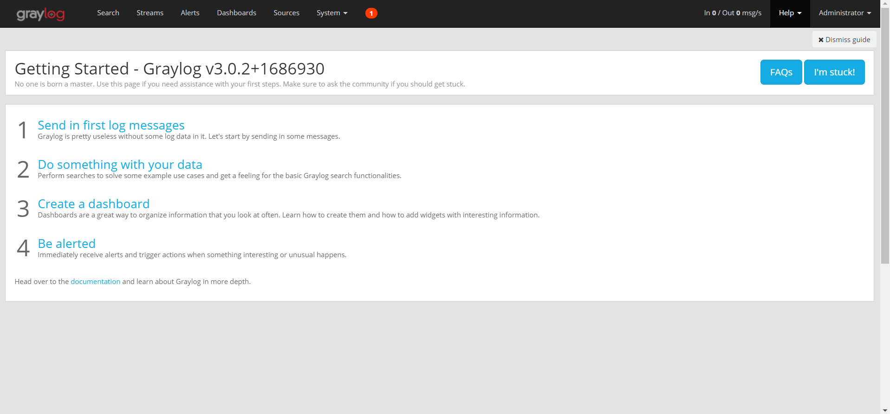
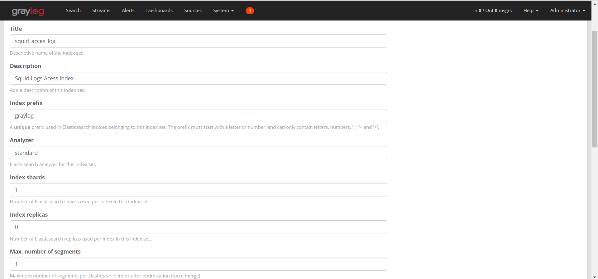
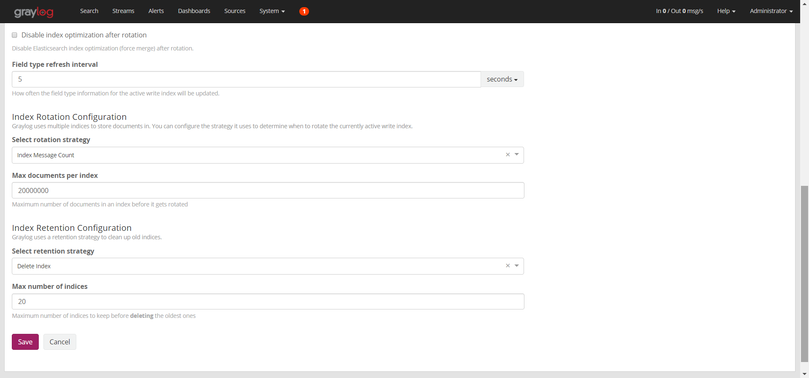
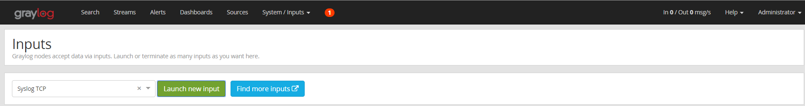
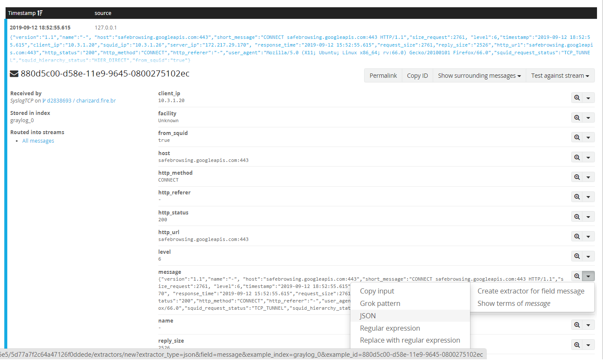

### Monitorando o uso de servidor proxy Squid utilizando Graylog, Elasticsearch e Grafana no CentOS 7

## Pré-requisitos

- **Elasticsearch** - Armazenamento dos logs e ferramenta de busca.
- **Graylog Server** - Análise e coleta dos logs. Insere os logs no Elasticsearch.
- **MongoDB** - Armazena as configurações e metadados do Graylog.
- **Grafana** - Visualização dos dados coletados pelo Graylog e inseridos no Elasticsearch.


## Desativando o Firewalld e o SELinux

O firewalld é uma ferramenta de gerenciamento de firewall para sistemas operacionais Linux. SELinux é uma camada de segurança extra para servidores que limita as ações dos usuários e programas pela imposição de políticas de segurança por todo o sistema operacional. Algumas dessas políticas e regras de firewall podem afetar o funcionamento dos serviços que vamos implementar, portanto vamos desativá-lo.

```shell
$ systemctl stop firewalld.service
$ systemctl disable firewalld.service

$ sed -i s/SELINUX=enforcing/SELINUX=disabled/g /etc/selinux/config
$ setenforce 0
$ reboot
```


## Instalando o Elasticsearch 6.x

O Graylog ainda não funciona com o Elasticsearch 7.x. O Elasticsearch é construído usando Java e requer pelo menos o Java 8 para ser executado. Portanto, antes de instalar o Elasticsearch, é necessário instalar o Java 8.

```shell
$ yum install java-1.8.0-openjdk.x86_64
```
Você pode verificar a versão do Java do sistema utilizando o comando **java -version**.

```shell
$ java -version
openjdk version "1.8.0_222"
OpenJDK Runtime Environment (build 1.8.0_222-b10)
OpenJDK 64-Bit Server VM (build 25.222-b10, mixed mode)
```

Vamos instalar a versão 6.8.3 do Elasticsearch.
```shell
$ wget https://artifacts.elastic.co/downloads/elasticsearch/elasticsearch-6.8.3.rpm

$ rpm --install elasticsearch-6.8.3.rpm
```

## Configurando o Elasticsearch

Em sua configuração básica, o Graylog requer que o nome do cluster do **Elasticsearch** seja definido como graylog. Portanto, vamos editar o arquivo de configuração do **Elasticsearch** localizado em **/etc/elasticsearch/elasticsearch.yml**.

```shell
$ vim /etc/elasticsearch/elasticsearch.yml
```

```diff
...
# -------------------- Cluster -------------------
#
# Use a descriptive name for your cluster:
#
- cluster.name: my-application
+ cluster.name: graylog
...
```

Feito isso, inicie o **Elasticsearch** e permita que ele seja executado na inicialização do sistema.

```shell
$ systemctl daemon-reload
$ systemctl start elasticsearch
$ systemctl enable elasticsearch
```
Para verificar se está tudo correto com a instalação e configuração do **Elasticsearch**, execute o seguinte comando:

```shell
$ curl -X GET http://localhost:9200
{
  "name" : "YCN0CIt",
  "cluster_name" : "graylog",
  "cluster_uuid" : "LsPVhXKvRaWmFQlxKSPZ0Q",
  "version" : {
    "number" : "6.8.3",
    "build_flavor" : "default",
    "build_type" : "rpm",
    "build_hash" : "0c48c0e",
    "build_date" : "2019-08-29T19:05:24.312154Z",
    "build_snapshot" : false,
    "lucene_version" : "7.7.0",
    "minimum_wire_compatibility_version" : "5.6.0",
    "minimum_index_compatibility_version" : "5.0.0"
  },
  "tagline" : "You Know, for Search"
}
```

## Instalando o MongoDB 4.0

Primeiro, crie o repositório YUM do MongoDB da seguinte forma:

```shell
$ vim /etc/yum.repos.d/mongodb-org-4.0.repo
```

```
[mongodb-org-4.0]
name=MongoDB Repository
baseurl=https://repo.mongodb.org/yum/redhat/7/mongodb-org/4.0/x86_64/
gpgcheck=1
enabled=1
gpgkey=https://www.mongodb.org/static/pgp/server-4.0.asc
```

Em seguida, instale o MongoDB através do gerenciador de pacotes **YUM**.

```shell
$ yum install mongodb-org
```

Após a instalação, inicie o serviço MongoDB e o habilite a executar na inicialização do sistema com os comandos a seguir:

```shell
$ systemctl start mongod
$ systemctl enable mongod
```
Para verificar se o MongoDB está rodando, execute o comando:

```shell
$ systemctl status mongod
● mongod.service - MongoDB Database Server
   Loaded: loaded (/usr/lib/systemd/system/mongod.service; enabled; vendor preset: disabled)
   Active: active (running) since Sat 2019-09-14 17:20:31 -03; 2h 50min ago
     Docs: https://docs.mongodb.org/manual
 Main PID: 841 (mongod)
   CGroup: /system.slice/mongod.service
           └─841 /usr/bin/mongod -f /etc/mongod.conf
```

Para verificar a versão do MongoDB, utilize o seguinte comando:
```shell
$ mongod --version
db version v4.0.12
git version: 5776e3cbf9e7afe86e6b29e22520ffb6766e95d4
OpenSSL version: OpenSSL 1.0.1e-fips 11 Feb 2013
allocator: tcmalloc
modules: none
build environment:
    distmod: rhel70
    distarch: x86_64
    target_arch: x86_64
```

## Instalando o Graylog 3.0

Execute o comando abaixo para instalar o repositório RPM do Graylog 3.0.

```shell
$ rpm -Uvh https://packages.graylog2.org/repo/packages/graylog-3.0-repository_latest.rpm
```

Em seguida, instale o Graylog Server 3.0.

```shell
$ yum install graylog-server
```
## Configurando o Graylog

Arquivo de configuração do Graylog: **/etc/graylog/server/server.conf**

Primeiramente, vamos gerar uma senha de segurança para proteger o armazenamento das senhas dos usuários. Para isso, vamos usar o gerador de senhas aleatórias, **pwgen**. 

Para instalar o **pwgen**, precisaremos instalar o pacote **epel-release** previamente com o seguinte comando:

```shell
$ yum install epel-release
```

Em seguida, vamos instalar o **pwgen** com o seguinte comando:

```shell
$ yum install pwgen
```

Para gerar a senha de segurança, execute o seguinte comando: 
```shell
$ pwgen -N 1 -s 96
FTeIZznMtCRXmP066trf4sd8tNMCMrOIkEVW0npqwiuMHjFK8otA8IIXggE0bVonVChzVsVLkpWidmsJQdH1wRLQNodRmIhY
```

Em seguida, vamos atribuir a senha gerada acima ao parâmetro ***password_secret*** no arquivo de configuração do Graylog.

```shell
$ vim /etc/graylog/server/server.conf
```

```diff
...
- password_secret =
+ password_secret = FTeIZznMtCRXmP066trf4sd8tNMCMrOIkEVW0npqwiuMHjFK8otA8IIXggE0bVonVChzVsVLkpWidmsJQdH1wRLQNodRmIhY
...
```

Para gerar o hash da senha do usuário **admin**, utilize o seguinte comando:

```shell
$ echo -n "SuaSenhaAqui" | sha256sum | cut -d" " -f1
a115236c51dd5498e7683f79d9de387c842f70c258f69719855184ed54ecea56
```

Depois, vamos atribuir o hash gerado acima ao parâmetro ***root_password_sha2*** do arquivo de configuração do Graylog.

```shell
$ vim /etc/graylog/server/server.conf
```

```diff
...
- root_password_sha2 =
+ root_password_sha2 = a115236c51dd5498e7683f79d9de387c842f70c258f69719855184ed54ecea56
...
```

Para acessar publicamente o Graylog, defina o endereço IP correto para os parâmetros ***http_bind_address*** e ***http_publish_uri***:

```shell
$ vim /etc/graylog/server/server.conf
```

```diff
...
- http_bind_address = 127.0.0.1:9000
+ http_bind_address = 10.3.1.26:9000

...

- http_publish_uri = http://127.0.0.1:9000/
+ http_publish_uri = http://10.3.1.26:9000/
...
```

Altere também o valor do parâmetro ***elasticsearch_shards*** para 1, pois iremos utilizar um Elasticsearch de nó único.
```shell
$ vim /etc/graylog/server/server.conf
```

```diff
...
- elasticsearch_shards = 4
+ elasticsearch_shards = 1
...
```

## Executando o Graylog
Execute os comandos abaixo para iniciar e permitir que o servidor Graylog seja executado na reinicialização do sistema.

```shell
$ systemctl start graylog-server
$ systemctl enable graylog-server
```

## Acessando a interface web do Graylog

Agora que o Graylog está rodando, você pode acessá-lo através de um browser usando o endereço: **http://ip_do_servidor:9000**.


Entre com o nome de usuário **admin** e a senha cujo hash foi gerado acima. Ao fazer o login, teremos acesso ao dashboard do Graylog.



## Criando Index Set para o Elasticsearch

O Graylog utiliza um ou mais conjunto de índices (index set) do Elasticsearch para otimizar as operações de pesquisa e análise com mais velocidade e baixo consumo de recursos.

Por padrão, o Graylog já cria um index set default. Caso o Graylog não crie esse index set default, você pode criar um índice acessando a interface web do Graylog, navegando até **System > Indices** e clicando em **Create Index Set**. Na página de configuração do índice, defina o nome do índice, descrição (opcional), um prefixo exclusivo para uso no Elasticsearch, número de shards do Elasticsearch e a estratégia de rotação do índice.




Quando terminar, clique em **Save** para salvar o índice. Para verificar o nome do índice para sua fonte de dados Elasticsearch, execute o seguinte comando:

```shell
$ curl -XGET ip_servidor_graylog:9200/_cat/indices?v
health status index     uuid                   pri rep docs.count docs.deleted store.size pri.store.size
green  open   graylog_0 C8i0-NybRrWtFnbubwIy3Q   1   0       6691            0      3.4mb          3.4mb
```

Nosso índice nesse caso é **graylog_0**.


## Enviando logs Squid para o Graylog


Agora vamos fazer com que o Squid repasse os logs geradospara servidor Graylog, para realizarmos a filtragem dos dados e enviar o resultado para o Elasticsearch. Para isso, vamos definir um novo formato de log no arquivo **/etc/squid/squid.conf** para formatar um log de acesso ao proxy em um formato JSON:

```shell
$ logformat graylog_vhost {"version": "1.1", "host": "% {Host}> h", "short_message": "% rm% ru HTTP /% rv", "level": 6, "timestamp": " % tl "," _ client_ip ":"%> a "," _ squid_ip ":"% la "," _ server_ip ":"% <a "," _ response_time ":"% tr "," _ request_size ":"%> st "," _ reply_size ":"% <st "," _ http_url ":"% ru "," _ http_status ":"%> Hs "," _ http_method ":"% rm "," _ http_referer ":"% {Referer}> h "," _ user_agent ":"% {User-Agent}> h "," _ squid_request_status ":"% Ss "," _ squid_hierarchy_status ":"% Sh "," _ from_squid ":" true "}
```

Exemplo do formato acima legível para humanos:

```shell
{
   "version": "1.1",
   "host": "% {Host}> h",
   "short_message": "% rm% ru HTTP /% rv",
   "nível": 6,
   "registro de data e hora": "% tl",
   "_client_ip": "%> a",
   "_squid_ip": "% la",
   "_server_ip": "% <a", 
   "_response_time": "% tr", 
   "_request_size": "%> st",
   "_reply_size": "% <st", 
   "_http_url": "% ru", 
   "_http_status": "%> Hs",
   "_http_method": "% rm",
   "_http_referer": "% {Referer}> h",
   "_user_agent": "% {User-Agent}> h",
   "_squid_request_status": "% Ss",
   "_squid_hierarchy_status": "% Sh",
   "_from_squid": "true"
}
```

Acesse o link [Squid 3.5.19 Configuration File: logformat](http://www.squid-cache.org/Versions/v3/3.5/cfgman/logformat.html) para outros argumentos de formato disponíveis.

O Squid é capaz de enviar cada linha de log de acesso como dados de texto para um receptor TCP ou UDP. Vamos usar essa funcionalidade para enviar os logs ao servidor Graylog . As seguintes linhas no arquivo de configuração do Squid,**/etc/squid/squid.conf**, farão o trabalho:

```shell
access_log udp:127.0.0.1:1031 graylog_vhost
access_log tcp:127.0.0.1:1030 graylog_vhost
```

Com isso, habilitamos o envio dos logs (já formatados em JSON, graças ao logformat **graylog_vhost**) para o servidor Graylog, nesse caso, rodando na mesma máquina que o Squid. 

Agora, precisaremos fazer com que o servidor Graylog receba os dados através das portas 1031 (udp) e 1030 (tcp), configuradas no arquivo ***/etc/squid/squid.conf***.

## Recebendo, interpretando e armazenando os logs recebidos

Primeiro vamos criar dois **"inputs"** para receber os logs enviados pelo Squid. Para isso, na interface web do Graylog, navegue até **System > Inputs**. Primeiro vamos configurar um input para receber os logs através da porta 1030, usando o protocolo TCP. Selecione **Syslog TCP** e clique em **Launch Input**:




Vamos configurar os seguintes valores para os parâmetros:

<ul>
  <li><b>Title: </b>Coloque um título simples para diferenciar o input do TCP do UDP</li>
  <li><b>Node: </b>Selecione o nó do Graylog que estamos trabalhando</li>
  <li><b>Bind address: </b> 127.0.0.1</li>
  <li><b>Port: </b>1030</li>
</ul>

Repita o procedimento para configurar o **input** UDP, selecionando **Syslog UDP** e trocando apenas os valores dos parâmetros **Title** e **Port** (1031).

Agora, vamos extrair os dados dos logs recebidos através dos inputs utilizando **extratores**. 

Primeiro, navegue até a página de pesquisa de mensagens, clicando em **Search** no menu superior. Em seguida, selecione um log recebido através de um dos inputs configurados anteriormente e localize o campo **"message"**. Clique na seta que aponta para baixo, selecione a opção **"Create extractor for field message"** e selecione o tipo **JSON**, como mostra a imagem a seguir:



Dê um nome para o extrator e clique em **Create extractor**. Pronto, o extrator está configurado. Agora é só repetir o processo selecionando um log recebido através do outro input.

Com isso, todos os dados extraídos dos logs utilizando os extratores serão armazenados no **Elasticsearch**, realizando uma filtragem nos dados recebidos diretamente nos inputs. 


